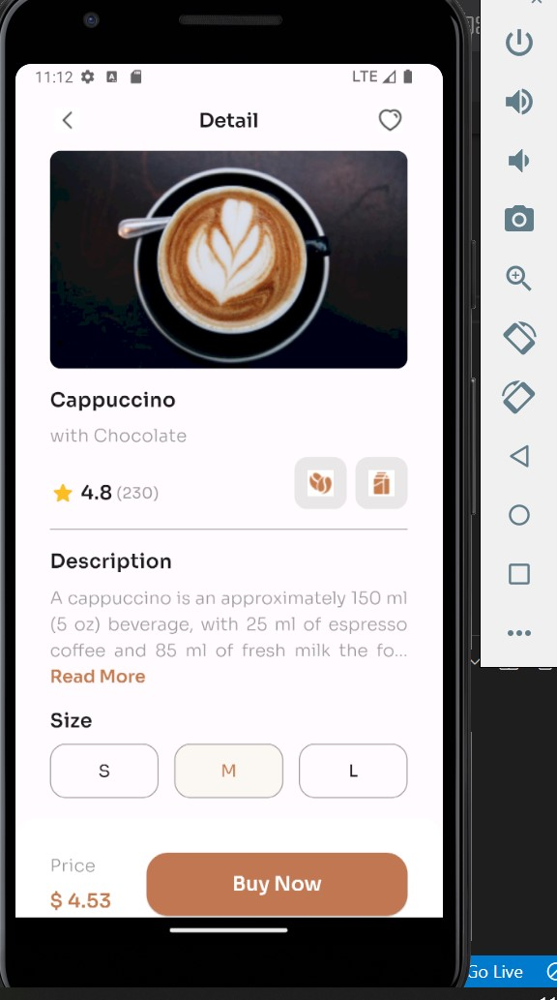

# Flutter App Development; Screenshot of my project

## Modularization and Organization Of My Code

The entirety of the project is to re-create the project image. The implementation serves to improve readability, maintainability, and organization by modularizing different sections of the app.

### Modular Components

1. **CustomAppBar:**

   - Extracted the custom app bar into a separate file `custom_app_bar.dart`.
   - Made the app bar more reusable by allowing custom tap handlers.

2. **ImageSection:**

   - Created a new file `image_section.dart` to encapsulate the image section.
   - The image section now has its own dedicated widget for better separation of concerns.

3. **ProductDetailsSection:**

   - Moved the product details section into `product_details_section.dart`.
   - Improved the structure and alignment of the product details.

4. **BuyNowSection:**
   - Separated the buy now section into its own file `buy_now_section.dart`.
   - Enhanced the layout and styling of the buy now section.

### Main File Organization

- The main.dart file has been cleaned up for better readability.
- Sections are now organized by importing modular components.

## Styling and Layout

1. **Consistent Padding:**

   - Ensured consistent padding throughout the app for better visual alignment.

2. **Button Styling:**

   - Styled the "Buy Now" button with rounded corners and a larger width.

3. **Text Alignment:**
   - Adjusted the text alignment for better presentation, especially for the description.

## Bug Fixes

1. **Overflow Issue:**

   - Addressed the RenderFlex overflow issue by using `Expanded` for text sections.

2. **UI Improvements:**
   - Improved UI alignment and spacing for a cleaner look.

## Next Steps

- Continue improving modularization.
- Refactor additional sections for better code organization.
- Address any further UI/UX enhancements based on project requirements.

Feel free to review the individual files for more details on each modular component.
**Yours Truly: Ehimze007**
